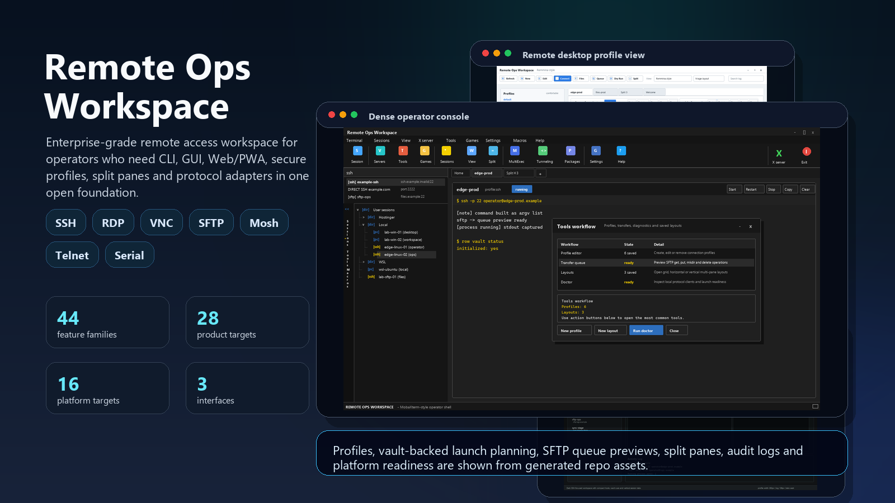
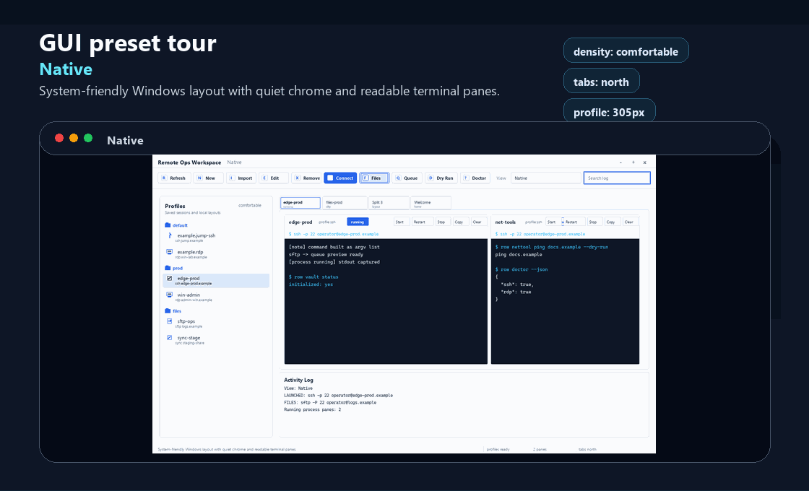
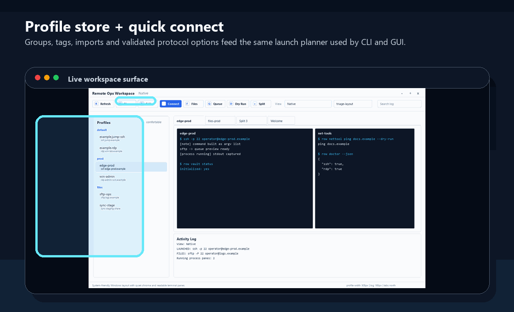
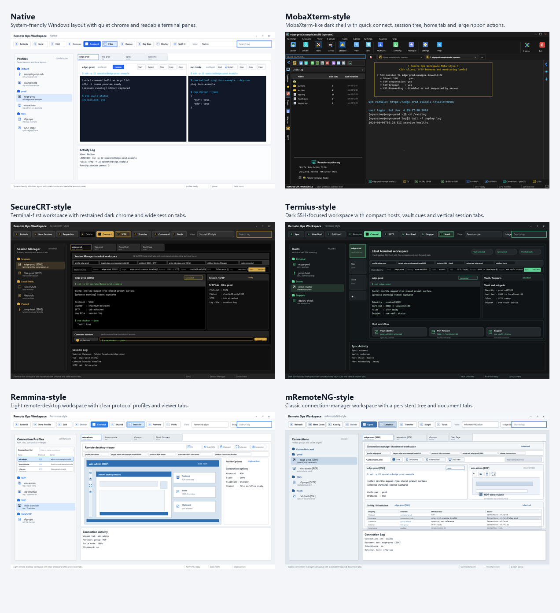

<div align="center">

# Remote Ops Workspace

### Operator-first remote terminal and connection workspace for SSH, RDP, VNC, SFTP, Mosh, Telnet, X11, SPICE, X2Go, ICA, HTTP/HTTPS, serial consoles, raw sockets, split panes, vaults, snippets, sync, CLI, GUI and Web/PWA.


[Visual Overview](#visual-overview) • [Quick Start](#quick-start) • [CLI](#cli) • [GUI](#gui) • [Web/PWA](#webpwa) • [Feature Coverage](#feature-coverage) • [Platforms](#platform-support) • [Architecture](#architecture) • [Security](#security) • [License](#license)

English • [Türkçe](README.tr.md)

<br>



</div>

---

## What this project is

**Remote Ops Workspace** is a MIT-licensed, cross-platform remote access workspace designed as an open foundation for the feature families people expect from MobaXterm, Remmina, mRemoteNG, Terminator and Termius.

It is intentionally built as an **adapter-first foundation**: the repo includes a working CLI, profile store, launcher command builders, optional encrypted vault support, GUI shell, Web/PWA shell, feature coverage manifest, tests, installers, CI and release scaffolding. Deep protocol rendering is delegated to native system tools such as OpenSSH, FreeRDP, TigerVNC, x2goclient, virt-viewer, PuTTY, Windows MSTSC, XQuartz/VcXsrv/Xorg, or future embedded protocol plugins.

> Not affiliated with Mobatek/MobaXterm, Remmina, mRemoteNG, GNOME Terminator, or Termius. Product names are used only to describe compatibility goals and feature coverage targets.

---

## Visual Overview

Generated README media lives in [`artifacts/readme`](artifacts/readme) and is built from the same tracked static GUI preview assets used by [`docs/GUI_DESIGN.md`](docs/GUI_DESIGN.md). They show the shipped workspace surfaces and feature flows in a deterministic gallery, while `python scripts/check_real_gui_render.py --timeout-seconds 240 --out-dir artifacts/gui-real` captures the real PyQt6 window when the desktop extra is installed.

<p align="center">
  
</p>

<p align="center">
  
</p>

<p align="center">
  
</p>

Regenerate the README media and GUI previews with:

```bash
python scripts/render_gui_design_previews.py
python scripts/render_readme_media.py
python scripts/check_readme_media.py
python scripts/check_real_gui_render.py
```

---

## Quick Start

```bash
git clone https://github.com/Yunushan/remote-ops-workspace.git
cd remote-ops-workspace

python -m venv .venv
# Linux/macOS/BSD/Solaris
. .venv/bin/activate
# Windows PowerShell
# .venv\Scripts\Activate.ps1

pip install -e ".[desktop,security]"
row init
row welcome
row profile add --name lab-ssh --protocol ssh --host ssh.example.invalid --username admin
row connect lab-ssh --dry-run
row doctor
```

Start the desktop UI:

```bash
row gui
```

Start the browser/PWA UI:

```bash
row serve-web --host 127.0.0.1 --port 8765
```

---

## CLI

```bash
row init
row welcome
row profile add --name core-rdp --protocol rdp --host rdp.example.invalid --username administrator
row profile add --name switch-console --protocol serial --path /dev/ttyUSB0 --option baud=115200
row profile add --name jump-ssh --protocol ssh --host ssh.example.invalid --username admin --option proxy_jump=bastion --option keepalive_interval=30
row profile add --name lab-vnc --protocol vnc --host vnc.example.invalid --option fullscreen=true --option shared=true
row profile list
row profile show core-rdp
row connect core-rdp --dry-run
row connect core-rdp
row features
row platforms
row vault init
row vault status
row vault set prod/router-password --secret-env ROW_ROUTER_PASSWORD
row vault list
row vault delete old/router-password --force
row plugins list
row plugins validate
row plugins scaffold --out ./row-demo-plugin --name row-demo-plugin --module row_demo_plugin --protocol demo --client demo-client
row customizer build --out ./dist/corp-row --brand-name "Corp Ops" --profiles configs/profiles.example.json --lock-setting theme=dark
row customizer deployment-plan --brand-name "Corp Ops" --lock-setting theme=dark --update-url https://updates.example.com/row/stable.json --update-public-key ed25519:QSOApv2JQKG8cVcGoYv++5EDw9fXbYNnXShgESontvI= --json
row customizer evidence-bundle --brand-name "Corp Ops" --organization "Corp Ops" --lock-setting theme=dark --update-url https://updates.example.com/row/stable.json --update-public-key ed25519:QSOApv2JQKG8cVcGoYv++5EDw9fXbYNnXShgESontvI= --out-dir artifacts/deployment --bundle-manifest-evidence artifacts/bundle-manifest.txt --installer-evidence artifacts/installer-branding.txt --policy-evidence artifacts/policy-locks.txt --update-evidence artifacts/update-channel.txt --update-manifest artifacts/stable-update.json --bundle-manifest-sha256 aaaaaaaaaaaaaaaaaaaaaaaaaaaaaaaaaaaaaaaaaaaaaaaaaaaaaaaaaaaaaaaa --sha256s-present --windows-exe-rebranded --windows-msi-rebranded --product-name-matches-brand --logo-applied --all-policy-surfaces-passed --https-update-url --signature-verified --organization-channel --json
row customizer update-verify --manifest artifacts/stable-update.json --public-key ed25519:QSOApv2JQKG8cVcGoYv++5EDw9fXbYNnXShgESontvI= --channel stable --organization "Corp Ops" --assets-dir artifacts --json
row customizer evidence-verify --evidence artifacts/deployment/moba-professional-deployment.json --assets-dir artifacts/deployment --json
row mobapt status --json
row mobapt runtime-status --json
row mobapt bundle-runtime --out dist/mobapt --tool bash --tool-source bash=vendor/mobapt/bin/bash --package htop=3.3 --package-source htop=3.3=vendor/mobapt/packages/htop-3.3.rowpkg --json
row mobapt install htop --json
row mobapt cache-verify --evidence artifacts/mobapt-cache-evidence.json --assets-dir artifacts --json
row servers status --json
row servers runtime-status --json
row servers bundle-runtime ssh --out dist/servers --runtime sshd --source vendor/servers/linux/ssh/sshd --system linux --json
row servers config-plan ftp --root . --json
row servers evidence-verify --evidence artifacts/servers-release-evidence.json --assets-dir artifacts --json
row servers start http --root . --dry-run --json
row features --coverage
row files ls lab-ssh /var/log --dry-run
row files get lab-ssh /etc/hosts --local ./hosts.copy --dry-run
row files queue lab-ssh --op "get /etc/hosts ./hosts.copy" --op "put ./build.tar.gz /tmp/build.tar.gz" --dry-run
row files preview-local ./README.md --json
row ssh-browser status --json
row ssh-browser overwrite upload ./build.tar.gz /tmp/build.tar.gz --destination-exists --json
row smartcard inventory-plan --provider microsoft-capi --json
row smartcard select-review lab-ssh --certificate-id cert-1 --certificate "cert-1|Operator Card|microsoft-capi" --add-to-mobagent --json
row smartcard ssh-browser-plan lab-ssh --certificate-id cert-1 --add-to-mobagent --json
row smartcard evidence-bundle lab-ssh --certificate-id cert-1 --certificate "cert-1|Operator Card|microsoft-capi|aaaaaaaaaaaaaaaaaaaaaaaaaaaaaaaaaaaaaaaaaaaaaaaaaaaaaaaaaaaaaaaa|ssh-rsa AAAA operator-card" --out-dir artifacts/smartcard --management-evidence artifacts/smartcard-management.txt --selection-evidence artifacts/smartcard-selection.txt --mobagent-evidence artifacts/smartcard-mobagent.txt --browser-evidence artifacts/smartcard-browser.txt --add-to-mobagent --gui-visible --add-remove-controls --openssh-public-key-visible --expert-setting-visible --certificate-selected --profile-saved --global-add-setting --agent-loaded-certificate --same-parameters-sftp --multiplex-mode --real-connected-session --sftp-browser-open --json
row smartcard evidence-verify --evidence artifacts/moba-smartcard.json --assets-dir artifacts --json
row text preview README.md --json
row text diff README.md README.tr.md --json
row text open-remote lab-ssh /etc/app.conf --local app.conf.edit --remote-sha256 aaaaaaaaaaaaaaaaaaaaaaaaaaaaaaaaaaaaaaaaaaaaaaaaaaaaaaaaaaaaaaaa --json
row text save-review lab-ssh /etc/app.conf --local app.conf.edit --original-remote-sha256 aaaaaaaaaaaaaaaaaaaaaaaaaaaaaaaaaaaaaaaaaaaaaaaaaaaaaaaaaaaaaaaa --current-remote-sha256 aaaaaaaaaaaaaaaaaaaaaaaaaaaaaaaaaaaaaaaaaaaaaaaaaaaaaaaaaaaaaaaa --json
row text evidence-bundle lab-ssh /etc/app.conf --out-dir artifacts/text-edit --local app.conf.edit --remote-sha256 aaaaaaaaaaaaaaaaaaaaaaaaaaaaaaaaaaaaaaaaaaaaaaaaaaaaaaaaaaaaaaaa --open-evidence artifacts/text-open.txt --save-review-evidence artifacts/text-save-review.txt --save-evidence artifacts/text-save.txt --connected-evidence artifacts/text-connected.txt --real-connected-session --sftp-browser-open --editor-tab-visible --json
row text evidence-verify --evidence artifacts/moba-text-remote-edit.json --assets-dir artifacts --json
row snippet add --name uptime --command "uptime" --tag ops
row macro record --name triage --text "hostname" --replace --json
row macro replay triage --profile lab-ssh --dry-run --json
row macro capture-plan triage --json
row macro live-plan triage --profile lab-ssh --connected-profile lab-ssh --pane-id lab-ssh=lab-pane --json
row macro evidence-bundle triage --profile lab-ssh --out-dir artifacts/macro-live --capture-evidence artifacts/macro-capture.txt --review-evidence artifacts/macro-review.txt --replay-evidence lab-ssh=artifacts/macro-replay-lab-ssh.txt --connected-profile lab-ssh --pane-id lab-ssh=lab-pane --gui-record-button --gui-stop-button --gui-cancel-button --per-event-timing-captured --confirmation-prompt --cancel-prompt-verified --conflict-checked --real-connected-session --live-terminal-pane --per-keystroke-timing-replay --json
row macro evidence-verify --evidence artifacts/moba-macro-live.json --assets-dir artifacts --json
row layout save triage --pane profile:lab-ssh --pane command:top --orientation horizontal
row layout run triage --dry-run
row broadcast --group prod --command "hostname" --timeout 10 --json
row keygen --out ~/.ssh/id_ed25519_row --comment row
row nettool ping example.com --dry-run
row x11 status --display :0 --json
row x11 package-status --json
row x11 bundle-runtime --out dist/xserver --runtime xvfb --source vendor/xserver/linux/bin/Xvfb --system linux --json
row x11 smoke --display :0 --out artifacts/x11-smoke.json --json
row x11 evidence-verify --evidence artifacts/moba-xserver-release.json --assets-dir artifacts --json
row x11 stop --json
row sync push --to ~/RemoteOpsSync
row export --out backups/remote-ops-export.json
row import --in backups/remote-ops-export.json
row import --in confCons.xml --format mremoteng
row import --in ~/.local/share/remmina --format remmina
```

Profiles are normalized and validated before storage, import results, GUI edits and launch planning. The launcher never concatenates shell strings. Protocol launches are built as safe argument arrays and can be inspected with `--dry-run` before execution. Per-protocol profile options cover OpenSSH keepalives/proxies/host-key policy, Mosh ports/prediction, RDP display/security/device flags, VNC/SPICE/X2Go viewer flags and serial line settings; see [`docs/PROTOCOLS.md`](docs/PROTOCOLS.md).

Profile imports support the native ROW bundle plus Remmina `.remmina`, mRemoteNG `confCons.xml`, Termius-style JSON host lists and MobaXterm session bookmark exports. See [`docs/IMPORTERS.md`](docs/IMPORTERS.md). File transfer queues, previews and `--force` requirements for destructive SFTP actions are documented in [`docs/FILE_TRANSFER.md`](docs/FILE_TRANSFER.md). Protocol plugin scaffolding and validation are documented in [`docs/PLUGIN_DEVELOPMENT.md`](docs/PLUGIN_DEVELOPMENT.md).

---

## GUI

The PyQt6 desktop shell provides:

- session tree and quick-connect panel;
- profile create/edit/remove dialogs backed by the same profile store as the CLI;
- external protocol launch buttons;
- interactive SFTP file browser panes and transfer queue preview dialog for SSH/SFTP profiles;
- tabbed workspace for process-backed sessions with close confirmation and cleanup;
- process-backed terminal panes with stdout/stderr capture, stdin entry and managed start/stop state;
- horizontal and vertical split-pane shells inspired by tiling terminals;
- selectable GUI view presets: Native, MobaXterm-style, SecureCRT-style, Termius-style, Remmina-style and mRemoteNG-style, with reproducible static previews and live PyQt6 render smoke checks documented in [`docs/GUI_DESIGN.md`](docs/GUI_DESIGN.md);
- saved layout selector plus create/edit/remove dialogs that open layout panes directly in the workspace;
- doctor/status panel;
- protocol launch plugin discovery through Python entry points plus `row plugins list` and `row plugins validate`;
- future extension seams for deeper PTY/qtermwidget/web terminal emulation.

Install optional GUI extras:

```bash
pip install -e ".[desktop,security]"
row gui
```

Windows native portable packages for x64 and ARM64 include a double-clickable
GUI launcher:

```text
Remote Ops Workspace GUI.exe
```

The same portable zips also keep `bin\row-gui.exe` and `bin\row.exe` for
scripted workflows. The 32-bit Windows x86 native package is CLI-first because
PyQt6 does not publish 32-bit Windows wheels.

---

## Web/PWA

`apps/web` contains a static browser workspace that can run as a PWA. It is useful for Android/iOS browser workflows, documentation demos and future API integration.

```bash
row serve-web --host 127.0.0.1 --port 8765
```

Then open the displayed URL from a browser or install it as a PWA. Binding to
`0.0.0.0`, `::` or another non-loopback interface requires
`--allow-public-bind`; use it only on trusted networks or inside the hardened
Docker entrypoint. The compose file publishes the container on
`127.0.0.1:8765` by default.

---

## Feature Coverage

Coverage target: **100% public feature-family mapping**, **100% adapter-ready coverage** and **100% release-backed product workflow parity** for the requested tools. Per-platform release readiness is tracked separately so verified release/mobile targets, manual architecture builds and legacy Windows remote-target tiers remain visible with their own scope.

Coverage is generated from [`configs/feature_manifest.json`](configs/feature_manifest.json). Feature-family mapping answers whether each public feature family is represented by built-in code, external adapters, optional implementations, CLI/GUI workflows, platform scripts, or plugin extension points. Adapter-ready coverage counts implemented adapter, optional, CLI, GUI and combined workflows as ready when they are tied to executable evidence. The `production_parity_coverage` JSON key is kept for compatibility, but the public contract is release-backed product workflow parity: implemented workflows count only when tied to executable release evidence, and seam-only or docs-only rows remain partial if they appear. This is not a proprietary native clone claim. The verifier runs both `scripts/check_feature_reality.py` and `scripts/check_product_readiness.py` so coverage claims stay tied to real CLI command paths, launch-plan builders, implementation symbols, shipped files and visible platform gaps.

For the stricter MobaXterm Home/Professional parity backlog, see [`docs/MOBAXTERM_PARITY.md`](docs/MOBAXTERM_PARITY.md). That ledger tracks remaining product-depth articles beyond the generated feature-family score, with accepted release evidence recorded in [`configs/mobaxterm_parity_evidence.json`](configs/mobaxterm_parity_evidence.json) and checked by `python scripts/check_mobaxterm_parity_evidence.py`.

| Product target | Feature-family mapping | Adapter-ready coverage | Release-backed workflow parity | Workflow gap to 100% | Feature families tracked |
|---|---:|---:|---:|---:|---:|
| MobaXterm | 100.0% | 100.0% | 100.0% | 0.0% | 50 |
| Remmina | 100.0% | 100.0% | 100.0% | 0.0% | 11 |
| mRemoteNG | 100.0% | 100.0% | 100.0% | 0.0% | 15 |
| Terminator | 100.0% | 100.0% | 100.0% | 0.0% | 8 |
| Termius | 100.0% | 100.0% | 100.0% | 0.0% | 22 |
| Devolutions Remote Desktop Manager | 100.0% | 100.0% | 100.0% | 0.0% | 26 |
| Royal TS / Royal TSX | 100.0% | 100.0% | 100.0% | 0.0% | 26 |
| Electerm | 100.0% | 100.0% | 100.0% | 0.0% | 19 |
| Tabby | 100.0% | 100.0% | 100.0% | 0.0% | 21 |
| SecureCRT | 100.0% | 100.0% | 100.0% | 0.0% | 19 |
| Xshell | 100.0% | 100.0% | 100.0% | 0.0% | 19 |
| Bitvise SSH Client | 100.0% | 100.0% | 100.0% | 0.0% | 9 |
| PuTTY | 100.0% | 100.0% | 100.0% | 0.0% | 11 |
| KiTTY | 100.0% | 100.0% | 100.0% | 0.0% | 12 |
| SuperPuTTY | 100.0% | 100.0% | 100.0% | 0.0% | 14 |
| Solar-PuTTY | 100.0% | 100.0% | 100.0% | 0.0% | 12 |
| MTPuTTY | 100.0% | 100.0% | 100.0% | 0.0% | 14 |
| Windows Terminal + OpenSSH | 100.0% | 100.0% | 100.0% | 0.0% | 17 |
| WinSCP | 100.0% | 100.0% | 100.0% | 0.0% | 10 |
| Apache Guacamole | 100.0% | 100.0% | 100.0% | 0.0% | 10 |
| XPipe | 100.0% | 100.0% | 100.0% | 0.0% | 16 |
| Muon SSH | 100.0% | 100.0% | 100.0% | 0.0% | 11 |
| ConEmu (with Cygwin / MSYS2 / SSH) | 100.0% | 100.0% | 100.0% | 0.0% | 12 |
| Cmder | 100.0% | 100.0% | 100.0% | 0.0% | 11 |
| Warp (macOS/Linux, Windows coming) | 100.0% | 100.0% | 100.0% | 0.0% | 12 |
| Hyper | 100.0% | 100.0% | 100.0% | 0.0% | 8 |
| X410 + any terminal (e.g., Windows Terminal, Alacritty) | 100.0% | 100.0% | 100.0% | 0.0% | 7 |
| Xming (or VcXsrv) + PuTTY / mRemoteNG | 100.0% | 100.0% | 100.0% | 0.0% | 10 |
| **Overall** | **100.0%** | **100.0%** | **100.0%** | **0.0%** | **70** |

Adapter-ready coverage and release-backed product workflow parity use the manifest status weights directly and do not use blanket per-product overrides. Platform verified readiness is still separate and currently reports **100.0% overall** for verified default-native, Termux/Web and Web/PWA release targets; manual Linux i386/armhf and legacy Windows rows remain visible outside the verified-readiness denominator. Protected platform goal parity is **0.0%** for the current accepted-evidence registry (status=missing-accepted-evidence); that separate goal is the only score that can reach 100% for Linux i386/armhf plus Windows XP x86/x64 native-host readiness.
Linux i386/armhf and Windows XP native-host promotion to 100% is gated by
[`configs/platform_parity_promotion.json`](configs/platform_parity_promotion.json)
and `python scripts/check_platform_parity_promotion.py`; real builder output is
validated with `python scripts/check_platform_promotion_artifacts.py`. Manual
self-hosted Linux evidence is collected by
`.github/workflows/extended-platform-evidence.yml`, and accepted records live in
[`configs/platform_verified_evidence.json`](configs/platform_verified_evidence.json)
after `python scripts/check_platform_verified_evidence.py` passes. Generate a
candidate accepted record with
`python scripts/make_platform_verified_evidence_record.py`, then finalize it
with `python scripts/finalize_platform_verified_evidence_record.py` so the
record binds the staged upload command, review-bundle manifest, archive and
SHA-256 sidecar. Candidate generation must pass
`--staged-upload-out-dir <release-upload-staging-dir>`, and XP candidates must
also pass `--xp-evidence-output-dir <xp-evidence-output-dir>`. Linux
release-source upload staging must use
`python scripts/stage_extended_linux_evidence_upload.py`, and XP release-source
upload staging must use `python scripts/stage_xp_native_evidence_upload.py`;
both stagers re-check finalized accepted-record assets before upload and require
the public final record to use canonical LF-terminated, sorted JSON bytes. Linux
accepted records include builder identity JSON plus its matching SHA-256,
sanitized target-scoped host identity, workflow dispatch input binding and a
`linux_smoke_summary` carrying the native smoke release/run, runtime
architecture, OpenSSL and legacy-crypto-scope proof values.
Linux native smoke proof lines are exact single-occurrence bindings; substring
matches, duplicated pass/security lines or case variants of forbidden
weak-security proof lines are not promotion evidence.
Windows XP accepted records include sanitized host identity SHA-256 and require
each smoke command/file to bind the same host label and evidence run ID; the
XP smoke proof is captured on real XP x86/x64 hosts with
`scripts/xp_smoke_runner.cmd`, then packaged by a modern self-hosted
`xp-evidence` collector rather than treating the collector as the XP host.
XP smoke proof lines are exact single-occurrence bindings; duplicated source,
artifact, host, OS or security proof lines are rejected, and weak-security
contradictions are rejected case-insensitively.
`python scripts/check_platform_verified_evidence.py`
validates the registry in finalized-only mode and rejects
`--allow-unfinalized-candidates`; candidate validation stays inside the
generator, review-bundle and finalization commands before registry append.
The goal-specific gate is
`python scripts/check_platform_verified_evidence.py --require-goal-targets --require-review-bundles --release-tag v<project.version>`;
it must fail until linux-i386, linux-armhf, windows-xp-native-x86 and
windows-xp-native-x64 all have finalized accepted records for the same release tag,
same GitHub release repository, target-specific release source workflow file,
same release source head SHA and a positive release source run attempt in each record. Mixed-tag,
mixed-repository or mixed-source-head accepted records remain visible as aggregate evidence,
but the protected goal parity block stays incomplete until one release source has all four targets. The release/verifier promotion
gate is `python scripts/verify.py --quick --no-cli-smoke --require-platform-goal-targets --release-tag v<project.version> --platform-review-bundle-dir <bundle-dir> --release-assets-dir <release-assets-dir> --release-repository <owner>/<repo>`,
which also runs `python scripts/check_protected_platform_goal.py --release-tag v<project.version> --require-complete --assets-dir <release-assets-dir> --repository <owner>/<repo>`
and `python scripts/check_release_publish_assets.py --assets-dir <release-assets-dir> --tag v<project.version> --repository <owner>/<repo> --require-platform-goal-targets`
and must fail until the same four records are finalized and accepted from that same release source.
The static readiness report keeps `release_asset_provenance_complete=false`;
only the asset-backed protected goal gate can flip that proof state after
checking finalized records, review bundles and native release bytes.
Add `--release-repository <owner>/<repo>` to the same strict verifier when validating
an already-published GitHub release; that also runs the live protected-platform
release/source-run audit. Today Linux i386 and
armhf remain script-supported at 70.0% until matching release builders, default
release matrix entries, smoke evidence, checksum sidecars and native manifests
with target architecture/format binding exist. Windows XP native-host readiness remains 25.0% until a separate
XP-capable legacy toolchain, x86/x64 XP host smoke evidence captured with
`scripts/xp_smoke_runner.cmd`, native artifact evidence, modern `xp-evidence`
collector packaging, and a passing `python scripts/check_xp_native_evidence.py --evidence <evidence.json> --assets-dir <artifact-dir>` bundle exist; XP remote-target coverage stays 100.0% through isolated legacy-profile opt-ins.
After a release is published, audit the actual GitHub release and evidence
workflow runs with
`python scripts/check_platform_release_evidence_remote.py --repository <owner>/<repo> --release-tag v<project.version> --require-goal-targets --require-source-runs --require-source-artifact-bytes --require-final-record-bytes --require-release-asset-bytes --require-tag-source-head`;
it must still fail if finalized accepted records, protected evidence release
assets, published asset digests, sizes and bytes, published final accepted-record JSON bytes,
release tag Git object/source head SHA, exact successful source workflow run
metadata, non-expired source workflow artifacts bound to those runs, or source artifact ZIP
contents matching `release_asset_source.contains_files` are
missing, or if stale protected-platform native/evidence assets remain on the
release outside the audited accepted-evidence scope. The release workflow runs that audit after
`softprops/action-gh-release` uploads the assets, using read-only Actions
metadata access plus the repository token.
For local live audits, set `GH_TOKEN` or `GITHUB_TOKEN` with `contents:read`
and `actions:read` access so GitHub API rate limits or artifact authorization
cannot hide the real evidence state.

Run:

```bash
row features --coverage
row features --coverage --json
```

The JSON report includes `workflow_parity_contract` and `workflow_parity_evidence`. Each evidence row lists the product row, mapped feature IDs, implementation status, implementation kind, manifest extension point and evidence refs used to justify the percentage. That is the source of truth for every 100% workflow-parity row.

| Feature family | MobaXterm | Remmina | mRemoteNG | Terminator | Termius | Project coverage |
|---|---:|---:|---:|---:|---:|---|
| SSH terminal sessions | ✅ | ✅ | ✅ | local shell | ✅ | Built-in OpenSSH adapter + profile store |
| RDP | ✅ | ✅ | ✅ | — | — | MSTSC/FreeRDP adapter |
| VNC | ✅ | ✅ | ✅ | — | — | TigerVNC/RealVNC adapter |
| SFTP/SCP/FTP file transfer | ✅ | profile/file features | — | — | ✅ | OpenSSH SFTP/SCP adapter + `row files` batch operations, transfer queues, previews, GUI SFTP pane |
| SSH-browser 26.4 behavior | ✅ | — | — | — | — | `row ssh-browser` persists side-by-side startup location, column widths and upload/download overwrite confirmation reviews; the connected PyQt Moba SFTP dock consumes the saved visibility, location and table-width state |
| Smart-card SSH / MobAgent | 26.4 CryptoAPI | — | — | — | OpenSSH | `row smartcard inventory-plan/select-review/mobagent-plan/ssh-browser-plan/evidence-bundle/evidence-verify` plus the PyQt Smart cards dialog cover certificate inventory, OpenSSH public-key retrieval, add/remove controls, SSH expert selection, MobAgent handoff, connected-session certificate/provider state and SHA-bound smart-card SSH-browser multiplex evidence |
| Text editor / diff | MobaTextEditor, MobaDiff | — | — | — | — | `row text preview/write/diff/remote-plan/open-remote/save-review/evidence-bundle/evidence-verify` with guarded saves, hash evidence, backups, SFTP get/put staging, direct connected editor-tab plans, PyQt SFTP-dock text editor widget, double-click open routing, save/diff capture, conflict reviews and SHA-bound remote-edit release evidence |
| Telnet/rlogin/rsh/raw sockets | ✅ | limited/plugins | ✅ | — | Telnet | External command adapters |
| Mosh | ✅ | plugins | — | — | ✅ | Mosh adapter |
| X11 forwarding / X server workflow | ✅ | X/SSH workflows | — | — | SSH forwarding | SSH `-X/-Y` + managed VcXsrv/XQuartz/Xorg/Xvfb runtime discovery, `row x11 bundle-runtime` packaged runtime assembly, packaged runtime preference, extension inventory, display collision checks, PID lifecycle state, X11 smoke evidence capture and forwarded-GUI release evidence verification |
| SPICE/X2Go/XDMCP | XDMCP | ✅ | — | — | — | virt-viewer/x2goclient/XDMCP adapters |
| ICA/Citrix | — | plugins | ✅ | — | — | `wfica` adapter |
| Session manager / groups / tags | ✅ | ✅ | ✅ | profiles | ✅ | JSON profile store, groups, tags, GUI profile editor |
| Tabs and split panes | ✅ | ✅ | ✅ | ✅ | multi-session | GUI shell + executable saved layouts and editor |
| Terminal syntax highlighting | ✅ | — | — | — | — | GUI terminal highlighter for prompts, notes, errors, warnings, IP addresses, paths and custom keyword rules |
| MobApt / Unix tools | ✅ | — | — | local shell | — | `row mobapt status` inventories Unix tools/package managers, `row mobapt runtime-status` scans ROW-owned Unix runtime/cache roots, `row mobapt bundle-runtime` assembles SHA-bound runtime/cache bundles, `row mobapt search/install/update` builds explicit host package-manager plans and `row mobapt cache-verify` validates offline package and terminal-use evidence |
| Embedded servers | ✅ | — | — | — | — | `row servers status/start/stop` covers loopback-safe HTTP serving plus SSH/SFTP, FTP, TFTP, Telnet, VNC and NFS daemon adapter lifecycle state; `row servers runtime-status/bundle-runtime/config-plan/evidence-verify` adds packaged daemon assembly/discovery, auth/hardening configuration plans, PyQt Servers dialog routing and client-proof release evidence validation |
| Broadcast input / command fanout | MultiExec | — | — | ✅ | snippets | Broadcast/fanout CLI with Moba-style MultiExec preview and per-target result reporting |
| Macros / snippets | ✅ | — | — | shortcuts | ✅ | Snippet model plus `row macro record/list/show/remove/replay/capture-plan/live-plan/evidence-bundle/evidence-verify` typed-event recording, SSH replay plans, PyQt terminal Record/Stop/Cancel/Replay controls, operator input capture, connected-pane timing plans, cancel prompts and SHA-bound live replay release evidence |
| Encrypted vault | passwords | password store | credential store | — | ✅ | Optional cryptography-based local vault |
| Cloud/team sync | shared sessions | — | shared config options | — | ✅ | Export/import + mounted/shared-directory provider |
| Keygen / SSH keys / agent | SSH keys | SSH keys | PuTTY keys | — | ✅ | OpenSSH keygen CLI |
| Hardware/FIDO keys | SSH support | SSH support | depends | — | ✅ | OpenSSH security-key keygen adapter |
| Portable mode | ✅ | packages | config portability | — | mobile/desktop | `ROW_HOME` portable data directory |
| Professional customization/deployment | Pro Customizer | — | — | — | teams | `row customizer build/deployment-plan/evidence-bundle/update-verify/evidence-verify` enterprise bundle, installer branding plan, `ROW_HOME/policy.json` hard-lock enforcement across profile storage, GUI editor, quick connect, launcher and Web/PWA, signed update-manifest verification, SHA-bound deployment evidence, manifest and SHA256SUMS |
| Web/mobile access | — | Kasm/container options | — | — | ✅ | Static Web/PWA shell + Android/iOS/PWA docs |
| Plugin architecture | plugins | plugins | extensions | plugins | integrations | Python entry-point protocol launch plugins + `row plugins list`, `row plugins validate` and `row plugins scaffold` |

See [`docs/FULL_FEATURE_COVERAGE.md`](docs/FULL_FEATURE_COVERAGE.md) and [`configs/feature_manifest.json`](configs/feature_manifest.json) for the full coverage manifest.

---

## Platform Support

| Platform | Target mode | Notes |
|---|---|---|
| Windows 10/11 | CLI, GUI, Web/PWA | Native x86, x64 and ARM64 release targets; OpenSSH, MSTSC, PuTTY, VcXsrv, TigerVNC adapters |
| Windows 8.1 | CLI/Web best effort, remote target | Source install depends on a compatible Python stack; remote management through RDP/VNC/SSH/Telnet/serial/raw sockets |
| Windows 8/7 | Legacy source-only, remote target | Keep as managed endpoints; modern native runtime support requires a separate legacy dependency stack |
| Windows Vista/XP | Remote target only | Windows XP remote-target coverage is 100.0% for x86 and x64 endpoints through isolated legacy profiles; no modern native Python/PyQt installer |
| Windows Server 2012–2025 | CLI, GUI optional, Web/PWA | Works well as an operator jump host; x86/x64/ARM64 depends on runner and Python availability |
| Linux | CLI, GUI, Web/PWA | Default GitHub release builds x86_64/amd64 and aarch64/arm64 native packages; i386/i686 and armhf mappings are script-supported on matching builders |
| Unix | CLI, Web/PWA, GUI where Qt is available | POSIX shell and OpenSSH first |
| FreeBSD/OpenBSD/NetBSD/DragonFlyBSD | CLI, Web/PWA, GUI where PyQt6 is packaged | External protocol tools vary by ports/pkg availability |
| Solaris/illumos | CLI, Web/PWA, GUI if Python/Qt stack exists | Focus on OpenSSH, browser, serial/raw sockets |
| macOS Intel/Apple Silicon | CLI, GUI, Web/PWA | OpenSSH, XQuartz, Microsoft Remote Desktop/FreeRDP, VNC viewers |
| Android | Web/PWA, Termux CLI | ARMv7 and ARM64 through Termux/Web; Android 12 through Android 16 (API 31-36) Web/PWA emulator CI; APK remains future work |
| iOS/iPadOS | Web/PWA | iOS/iPadOS 15 through 26.x Web/PWA contract with current Xcode simulator smoke; native `.ipa` remains future work |
| Web | PWA shell | Static PWA shell; API/backend can be layered on |

---

## Architecture

```text
remote-ops-workspace/
├── src/remote_ops_workspace/     # Python core, CLI, GUI shell, vault, launchers
├── apps/web/                     # Static Web/PWA workspace
├── configs/                      # Example profiles, settings, feature and platform target manifests
├── docs/                         # Feature coverage, platform, security, runbooks
├── installers/                   # install.sh, install.ps1, install.bat
├── scripts/                      # platform doctor, release helper, support bundle
├── tests/                        # Unit tests for core behavior
└── .github/workflows/            # CI and release automation
```

Core design principles:

1. **No proprietary client code**: launch and integrate open/system protocol tools unless a future plugin adds an embedded engine.
2. **Safe-by-default launching**: command arrays instead of shell strings.
3. **Portable profiles**: JSON profile store, environment-driven data path, backup/export/import.
4. **Security boundary clarity**: local encrypted vault support, no secrets committed, redaction utilities.
5. **Plugin honesty**: protocol launch plugins are wired through entry points and can be validated with `row plugins validate`; broader backend seams stay documented as future work until they have a caller path.

---

## Security

- Do not commit real profiles, passwords, private keys, vault files, or customer hostnames.
- Use `ROW_HOME` for portable/private operator workspaces.
- Store examples only under `configs/*.example.*`.
- Use `row connect NAME --dry-run` before launching newly imported profiles.
- Vault encryption requires the optional `security` extra: `pip install -e ".[security]"`.
- Use `row vault set NAME --secret-env ENV` or `row vault set NAME --stdin` for automation so secret values are not placed in argv or shell history.
- `row vault get` requires explicit `--show` or `--out`; secrets are not printed by default.
- `row keygen --passphrase-env` keeps software-key passphrases out of `ssh-keygen` argv by generating encrypted keys in-process.
- Shared profile validation checks protocol names, required targets, hosts, ports and URLs; command builders also validate snippets, broadcast payloads and X11 display names before starting external tools.
- Destructive SFTP actions, remote-overwrite-prone uploads and local-overwrite downloads are blocked before execution unless an operator passes `--force`; broad delete targets and remote globs are rejected for deletes/renames.
- `row serve-web` binds to loopback by default, adds static-app security headers, disables directory listing and requires `--allow-public-bind` for non-loopback interfaces. The web Docker image runs as a non-root user and compose binds to localhost with dropped Linux capabilities.
- Prefer SSH `proxy_jump`; `proxy_command` requires explicit `allow_unsafe_proxy_command=true`.
- SSHv1 legacy profiles require `--protocol ssh1`/`sshv1`,
  `--option allow_insecure_sshv1=true`, `--option legacy_target=windows-xp-32`
  or `windows-xp-64`, and `--option allow_legacy_crypto=true`; protocol v1
  remains insecure and should only be used for isolated legacy systems.
- Weak SSH algorithms and RDP `security=rdp` are blocked for modern profiles;
  Windows XP x86/x64 remote endpoints use isolated per-profile legacy opt-ins.
- Treat protocol plugins as trusted local Python code; use `row plugins validate` to catch load failures and invalid sample launch plans before using plugin-backed profiles.
- See [`SECURITY.md`](SECURITY.md) and [`docs/SECURITY_MODEL.md`](docs/SECURITY_MODEL.md).

---

## Development

```bash
python -m venv .venv
. .venv/bin/activate
pip install -e ".[desktop,security,dev]"
python scripts/verify.py
```

Pull-request and push CI runs `python scripts/verify.py --lint` across the
Python/OS matrix. A dedicated Linux job provisions `fontconfig` and
`fonts-dejavu-core`, installs the desktop extra, and runs
`python scripts/check_real_gui_render.py --require-pyqt6 --timeout-seconds 240`
against a live offscreen PyQt6 window. The renderer fails closed when Qt exposes
no font families, cannot resolve the probe glyphs, substitutes one tofu glyph,
or paints too little text ink. That job also runs `python
scripts/check_gui_interactions.py --require-pyqt6` for real button, menu, dialog,
search, terminal and saved-layout behavior.

A separate `windows-2025-vs2026` job uses `QT_QPA_PLATFORM=windows` to run both
the complete six-preset renderer/artifact validator and the interaction gate. It
uploads `gui-real-render-windows` and `gui-interactions-windows` independently
from the Linux `gui-real-render` and `gui-interactions-linux-offscreen`
artifacts. `python scripts/check_ci_workflow.py` keeps those gates from drifting.

The interaction gate declares **1024x768** as the minimum readiness-gated GUI
window boundary. Every preset must render at that exact size with its visible
toolbar actions inside the toolbar and with no Qt overflow-extension button;
central evidence panels, status cells and profile columns must also remain
inside their parent bounds without intersecting. Compact visible values retain
their exact label/value metadata and full literal tooltip. Larger supported
sizes are exercised too. Windows narrower than 1024 pixels are not part of the
release-readiness claim.

Use `python scripts/verify.py --require-real-gui` on a desktop-extra install
when local verification must fail unless the real PyQt6 GUI screenshot gate
runs instead of the dependency-missing fail-closed path.

After downloading the CI `gui-real-render` or `gui-real-render-windows`
artifact, run
`python scripts/check_real_gui_render_artifact.py --artifact-dir <artifact-dir>`
to validate the live PNG captures, manifest, PNG dimensions, sizes, SHA-256
hashes, measured product-style layout/topology evidence, platform-specific
capture mode, and per-capture `font_render_evidence`.

Use `python scripts/verify.py --quick` only for dependency-constrained review
environments where `pytest` is unavailable. See
[`docs/VERIFYING.md`](docs/VERIFYING.md).

Repository cleanup before tagging:

```bash
python scripts/check_repository_cleanup.py
python scripts/check_repository_cleanup.py --require-clean
```

Create local release bundles for the advertised targets:

```bash
python scripts/make_release.py
```

The GitHub release workflow is manually promoted from the trusted default branch
with an immutable tag input such as `v1.0.5`; it builds that tag and uploads
these assets only after accepted platform evidence is present:

| Target | Asset |
|---|---|
| Python wheel | `remote_ops_workspace-1.0.5-py3-none-any.whl` |
| Python sdist | `remote_ops_workspace-1.0.5.tar.gz` |
| Source | `remote-ops-workspace-v1.0.5-source.zip` |
| Windows | `remote-ops-workspace-v1.0.5-windows.zip` |
| Linux | `remote-ops-workspace-v1.0.5-linux.tar.gz` |
| macOS | `remote-ops-workspace-v1.0.5-macos.tar.gz` |
| BSD | `remote-ops-workspace-v1.0.5-bsd.tar.gz` |
| Solaris/illumos | `remote-ops-workspace-v1.0.5-solaris.tar.gz` |
| Android/Termux | `remote-ops-workspace-v1.0.5-android-termux.tar.gz` |
| iOS/iPadOS Web/PWA | `remote-ops-workspace-v1.0.5-web-pwa.zip` |
| Web/PWA | `remote-ops-workspace-v1.0.5-web-pwa.zip` |
| Windows native | `remote-ops-workspace-v1.0.5-windows-<x86\|x64\|arm64>-setup.exe` |
| Windows native | `remote-ops-workspace-v1.0.5-windows-<x86\|x64\|arm64>.msi` |
| Windows native | `remote-ops-workspace-v1.0.5-windows-<x86\|x64\|arm64>-native.zip` |
| macOS native | `remote-ops-workspace-v1.0.5-macos-<x64\|arm64>.dmg` |
| macOS native | `remote-ops-workspace-v1.0.5-macos-<x64\|arm64>.pkg` |
| macOS native | `remote-ops-workspace-v1.0.5-macos-<x64\|arm64>-native-manifest.json` |
| Linux native | `remote-ops-workspace-v1.0.5-linux-<amd64\|arm64>.deb` |
| Linux native | `remote-ops-workspace-v1.0.5-linux-<x86_64\|aarch64>.rpm` |
| Linux native | `remote-ops-workspace-v1.0.5-linux-<x86_64\|aarch64>.AppImage` |
| Linux native | `remote-ops-workspace-v1.0.5-linux-<x86_64\|aarch64>-native.tar.gz` |
| Linux native | `remote-ops-workspace-v1.0.5-linux-<x86_64\|aarch64>-native-manifest.json` |
| Manifests | `remote-ops-workspace-v1.0.5-*-manifest.json` |
| Checksums | `remote-ops-workspace-v1.0.5-SHA256SUMS.txt` |

Native protocol rendering still depends on the external clients installed on the target system.
Windows x64 and ARM64 native portable zips include a top-level
`Remote Ops Workspace GUI.exe` double-click launcher, plus `bin\row-gui.exe`;
`bin\row.exe` remains the CLI entry point.
In those frozen Windows packages, `row gui` delegates to the sibling
`bin\row-gui.exe` launcher.
Windows XP/Vista/7/8 are supported as legacy remote targets, not as first-class
modern native operator hosts. Windows XP x86/x64 remote endpoints use isolated
per-profile legacy opt-ins so weak SSH/RDP compatibility does not lower modern
Windows 10/11, Linux or macOS defaults. The default GitHub workflow builds Windows
`x86`/`x64`/`arm64`, macOS `x64`/`arm64`, and Linux `x86_64`/`aarch64`
native jobs. The native build scripts also map Linux `i386`/`i686` and
`armhf` outputs for matching builders, but those are not uploaded by the
default release. Android remains Termux/Web with no APK published, and
iOS/iPadOS is Web/PWA only; no native `.ipa` or App Store package is published.
Mobile CI covers Android 12 through Android 16 (API 31-36) Web/PWA emulator
smoke and iOS/iPadOS 15 through 26.x Web/PWA compatibility, with simulator smoke
on the current GitHub macOS/Xcode runtime.
The machine-readable release decision lives in
[`configs/release_matrix.json`](configs/release_matrix.json), while
[`configs/platform_targets.json`](configs/platform_targets.json) remains the
broader platform support catalog exposed by `row platforms --json`.
That catalog also carries a `protected_readiness_goal` metadata block that
marks the static catalog boundary as `not native-host/readiness proof`, points
JSON consumers to `configs/platform_verified_evidence.json`, and records the
accepted-evidence plus asset-provenance gates for Linux i386/armhf and Windows
XP native-host readiness.
Release manifests include `size_bytes` and `sha256` for each artifact, and CI
build jobs run with read-only checkout credentials until the final publish step.
The release workflow also starts with a `release-preflight` job that runs
`python scripts/verify.py --quick --no-cli-smoke --release-tag <tag>`,
`python scripts/check_protected_platform_goal.py --release-tag <tag> --require-records-complete --show-requirements`,
`python scripts/check_platform_verified_evidence.py --require-goal-targets --require-review-bundles --release-tag <tag>`
and `python scripts/check_repository_cleanup.py --require-clean`; source, native
`accepted-platform-evidence-assets` and publish jobs all depend on that gate.
Windows XP proof for those accepted records is captured on real XP hosts with
`scripts/xp_smoke_runner.cmd`; the modern self-hosted `xp-evidence` collector
packages and validates staged evidence, but is not counted as the XP host.
Linux accepted records in the same path must include `linux_smoke_summary`
runtime, OpenSSL and profile-only legacy crypto proof values alongside the
captured smoke log hash.
The `accepted-platform-evidence-assets` job runs
`python scripts/import_platform_evidence_artifacts.py --release-tag <tag> --require-goal-targets --out-dir release-assets --verify-source-run --repository <owner>/<repo>`
to copy only same-tag, same-repository, workflow-file, source-head and
run-attempt-bound accepted evidence artifacts into the release asset directory
after checking exact source artifact `workflow_run.id`,
`workflow_run.head_sha`, `workflow_run.repository_id` and
`workflow_run.head_repository_id` binding when exact repository IDs are
available, artifact created_at inside the exact source run creation/start/update window
when GitHub exposes timestamps, plus downloaded source artifact native artifact SHA-256 values and
review-bundle size/SHA-256 values against the finalized accepted record,
then runs
`python scripts/check_platform_review_bundle_artifacts.py --bundle-dir release-assets --require-goal-targets --release-tag <tag> --require-final-record-assets`
against the imported review bundles and finalized public record JSON files
before upload; final public records must use canonical LF-terminated sorted JSON
bytes so post-upload release asset digests are stable. The imported platform
evidence artifact upload fails when empty, excludes hidden files and keeps a
90-day retention window. That import job keeps only read permissions for
repository contents and Actions artifacts, and source and native release jobs
wait for it before building. Linux i386, Linux armhf,
windows-xp-native-x86 and windows-xp-native-x64 require finalized accepted
evidence records for the same release tag, GitHub release repository,
target-specific release source workflow file, release source head SHA and
per-record release source run attempt before any 100%
platform-readiness or native-host parity claim.
The static readiness report intentionally leaves
`release_asset_provenance_complete=false`; the asset-backed protected goal gate
is the proof that finalized accepted records, review bundles and native release
bytes match before upload.
Before upload, the publish job runs
`python scripts/check_protected_platform_goal.py --release-tag <tag> --require-complete --assets-dir release-assets --repository <owner>/<repo>`
and then
`python scripts/check_release_publish_assets.py --assets-dir release-assets --tag <tag> --repository <owner>/<repo> --require-platform-goal-targets`
to verify the downloaded asset set, finalized protected-platform records,
review bundles, native artifacts, checksum sidecars and release manifest
against `configs/release_matrix.json`, `configs/platform_verified_evidence.json`
and the accepted review-bundle hashes; the same check validates
`configs/mobaxterm_parity_evidence.json`, and
`--require-mobaxterm-parity-complete` is the hard gate for releases that claim
complete strict MobaXterm Home/Professional product-depth parity.
After upload, the publish job runs
`python scripts/check_platform_release_evidence_remote.py --repository <owner>/<repo> --release-tag <tag> --require-goal-targets --require-source-runs --require-source-artifact-bytes --require-final-record-bytes --require-release-asset-bytes --require-tag-source-head`
against the actual GitHub release, requiring published asset digests, sizes and bytes,
published final accepted-record JSON bytes, release tag Git object/source head SHA,
exact source workflow run metadata,
and source artifact `workflow_run.id`,
`workflow_run.head_sha`, `workflow_run.repository_id` and
`workflow_run.head_repository_id` binding when GitHub exposes repository IDs,
plus artifact created_at inside the exact source run creation/start/update window when
GitHub exposes timestamps, and source artifact ZIP contents matching
`release_asset_source.contains_files`.
Local live runs should set `GH_TOKEN` or `GITHUB_TOKEN` with `contents:read`
and `actions:read` access before auditing the published release.
Python release tooling is constrained by `requirements-release.txt` and recorded
in each release manifest through `configs/release_toolchain.json`. Native
Windows, macOS and Linux jobs also emit per-platform `native-SHA256SUMS.txt`
sidecars for their native artifacts and manifests.
Native installer smoke coverage is declared in
[`configs/native_installer_smoke.json`](configs/native_installer_smoke.json)
and checked by `python scripts/check_native_installer_smoke.py`. The release
workflow runs `scripts/smoke_windows_native.ps1`,
`scripts/smoke_macos_native.sh` and `scripts/smoke_linux_native.sh` after native
builds and before upload, covering install, verify, upgrade and uninstall paths
for `.exe`, `.msi`, `.dmg`, `.pkg`, `.deb`, `.rpm` and AppImage artifacts.

Release phases:

| Phase | Release assets | Status |
|---|---|---|
| 1 | Python wheel/sdist plus zip/tar.gz target bundles | Active |
| 2 | Windows `.exe`, `.msi`, and portable `.zip` | Active |
| 3 | macOS `.dmg` and `.pkg` | Active |
| 4 | Linux `.deb`, `.rpm`, AppImage, and native tarball | Active |

See [`docs/RELEASE_STRATEGY.md`](docs/RELEASE_STRATEGY.md).

---

## License

MIT. See [`LICENSE`](LICENSE).
